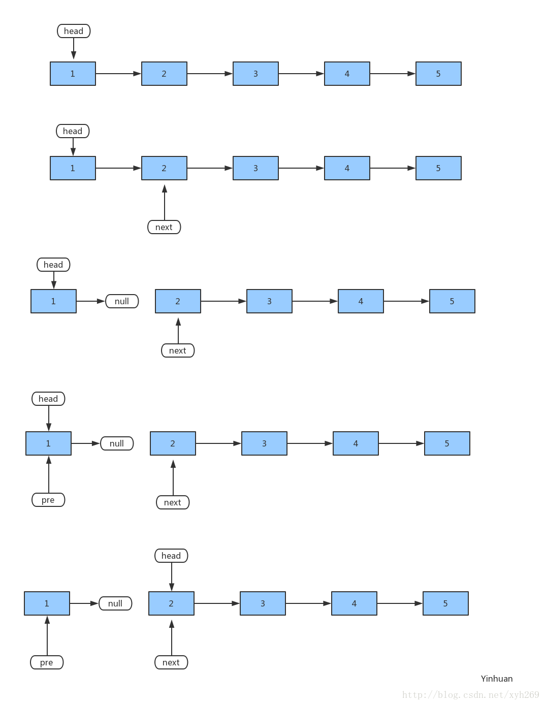
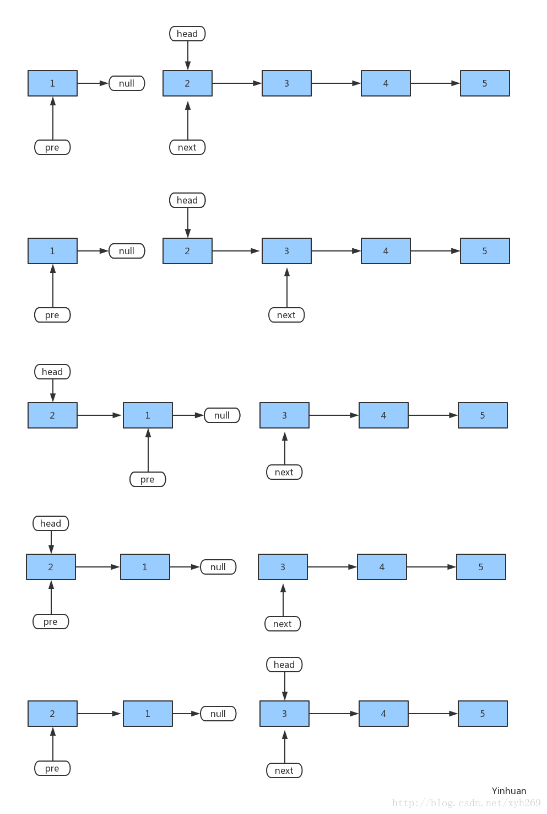

### 归并排序
- 原理  
归并排序是一种概念上最简单的排序算法，与快速排序一样，归并排序也是基于分治法的。归并排序将待排序的元素序列分成两个长度相等的子序列，为每一个子序列排序，然后再将他们合并成一个子序列。合并两个子序列的过程也就是两路归并。  
- 复杂度  
归并排序是一种稳定的排序算法，归并排序的主要问题在于它需要一个与待排序数组一样大的**辅助数组空间**。由于归并排序每次划分时两个子序列的长度基本一样，所以归并排序最好、最差和平均时间复杂度都是nlog2n。  

- 代码
```java
import java.util.*;

public class Test {
    public static void main(String[] args) {
        int[] sortArr = { 49, 38, 65, 97, 76, 13, 27, 50};
        mergeSort(sortArr, 0, sortArr.length - 1);

        System.out.println(Arrays.toString(sortArr));
    }

    public static void mergeSort(int[] a, int left, int right) {
        int mid = left + (right - left) / 2;
        if (left < right) {
            // 左右归并
            mergeSort(a, left, mid);
            mergeSort(a, mid + 1, right);
            // 合并数列
            // 当子序列只有一个元素是结束递归
            // 执行合并操作，即left==right
            merge(a, left, mid, right);
            System.out.println("数组排序" + Arrays.toString(a));
        }
    }

    public static void merge(int[] a, int left, int mid, int right) {
        //定义辅助数组
        int[] tmp = new int[right - left + 1];
        int i = left, j = mid + 1;
        int k = 0;
        while (i <= mid && j <= right) {
            if (a[i] < a[j]) {
                tmp[k++] = a[i++];
            } else {
                tmp[k++] = a[j++];
            }
        }
        //补充左右数组
        while (i <= mid) {
            tmp[k++] = a[i++];
        }
        while (j <= right) {
            tmp[k++] = a[j++];
        }
        // 复制回原来数组
        for (int l = 0; l < tmp.length; l++) {
            a[left + l] = tmp[l];
        }
    }
}
```
### 21.合并两个有序链表
- 描述:  
*将两个有序链表合并为一个新的有序链表并返回。新链表是通过拼接给定的两个链表的所有节点组成的。*  
- 示例  
输入：1->2->4, 1->3->4  
输出：1->1->2->3->4->4  
- 分析  
- 代码
```java
class ListNode {
    int val;
    ListNode next;
    ListNode(int value){
        val = value;
    }
}

class Solution {
    public ListNode mergeTwoLists(ListNode l1, ListNode l2) {
        // 类似归并排序中合并过程
        ListNode resHead = new ListNode(0);
        // cur 在算法结束时不再指向链表的头部，所以一开始需要有个虚拟头结点 resHead 保留对链表头部的引用
        ListNode cur = resHead;
        while (l1 != null && l2 != null) {
            if (l1.val < l2.val) {
                cur.next = l1;
                cur = cur.next;
                l1 = l1.next;
            } else {
                cur.next = l2;
                cur = cur.next;
                l2 = l2.next;
            }
        }

        // 任意为空，返回另外一个
        if (l1 == null) {
            cur.next = l2;
        } else {
            cur.next = l1;
        }
        // 初始列表值为0，所以指向下一个
        return resHead.next;
    }
}
```
- 测试
```java
public class MainTest {
    public static void main(String[] args) {
        ListNode l1 = new ListNode(1);
        l1.next = new ListNode(2);
        l1.next.next = new ListNode(4);

        ListNode l2 = new ListNode(1);
        l2.next = new ListNode(3);
        l2.next.next = new ListNode(4);

        Solution st = new Solution();
        ListNode res = st.mergeTwoLists(l1, l2);

        // 遍历列表
        while (res != null) {
            System.out.println(res.val);
            res = res.next;
        }
    }
}
```
### 反转链表
- 描述  
反转一个单链表  
- 示例  
输入: 1->2->3->4->5->NULL  
输出: 5->4->3->2->1->NULL  
- 分析  
第一步：next = head.next
将 head.next 赋值给 next 变量，也就是说 next 指向了节点2，先将节点2 保存起来。  
第二步：head.next = pre  
将 pre 变量赋值给 head.next，即 节点1 指向了 null  
第三步：pre = head  
将 head 赋值给了 pre，即 pre 指向节点1，将节点1 设为“上一个节点”  
第四步：head = next  
将 next 赋值给 head，即 head 指向了节点2。将节点2 设为“头节点”  

第一步：next = head.next  
将 head.next 赋值给 next 变量，也就是 next 指向了节点3，先将节点3 保存起来。  
第二步：head.next = pre
将 pre 赋值给 head.next，pre 在上一次循环的时候指向了节点1，那么这一步的意义就是节点2 指向了 节点1，完成一次反转    
第三步：pre = head   
将 head 赋值给了 pre，即 pre 指向节点2，将节点2 设为“上一个节点”  
第四步：head = next  
将 next 赋值给 head，即 head 指向了节点3。将节点3 设为“头节点”  

- 代码实现
```java
class Solution {
    // 迭代法
    public ListNode reverseList(ListNode head) {
        ListNode pre = null; //前指针节点
        while (head != null) {
            ListNode next = head.next; //临时节点
            head.next = pre; //将当前节点指向他前面的节点
            pre = head;
            head = next;
        }
        return pre;
    }
}
```
